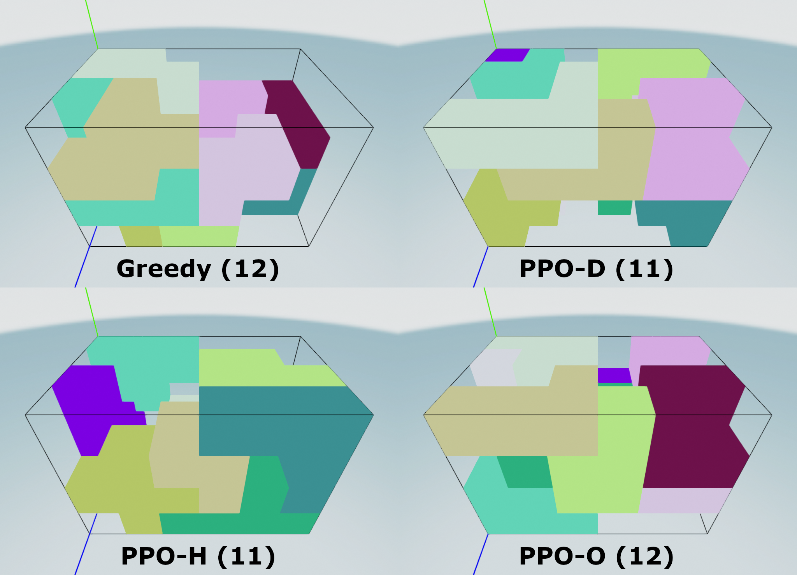

# Online-Polycube-Packing

## Introduction
Bin Packing Problems (BPP) are some of the most popular and well-studied combinatorial optimization problems.
Given a bin / container with fixed dimensions, the goal is to pack as many (geometric) items as possible.
Traditionally, BPP assumes that all items to be packed are known a priori, which is referred to as offline BPP.
However, in many real-world applications items arrive sequentially, and it is not always possible to move items once they have been placed in the container.
This variation is known as online BPP, and is considered harder because of the limited information available.

In this repository we provide a highly customizable Python-based framework for the **online polycube packing problem**: a variant of online 3D-BPP that uses [polycubes](https://en.wikipedia.org/wiki/Polycube) as items.
This framework, among other things, includes:

- A [Gymnasium](https://github.com/Farama-Foundation/Gymnasium)-based packing environment, where the state space is the current state of the container together with the current polycube, and the action space is the position and orientation to place the current polycube.
- A customizable greedy agent, that can pack polycubes based on a set of heuristics. Implemented heuristics include [BLBF](https://link.springer.com/chapter/10.1007/978-3-540-30198-1_45), [HAPE](https://link.springer.com/article/10.1631/jzus.A1100038), and [Heightmap Minimization](https://arxiv.org/abs/1812.04093).
- A reinforcement learning agent that uses [Proximal Policy Optimization (PPO)](https://arxiv.org/abs/1707.06347) together with [action masking](https://arxiv.org/abs/2006.14171) to learn how to optimally pack a container using the given polycubes.
- An [Open3D](https://www.open3d.org/)-based UI that can visualize the packing process, either through step-by-step polycube placement or a final packing preview.

## Dependencies
See `requirements.txt`.

## Usage
See `examples/` for a series of examples on how to use various aspects of the code:

- `constraints.py`, `heuristic_packing.py`, `packing_with_ui.py`, and `ppo_packing.py` all show examples of how to pack a container piece-by-piece using the Open3D-based UI. To place the next shape, use the `next shape` button under the `actions` tab at the top of the UI.
- `full_packing.py` shows how to pack a container without using the UI.
- Files starting with `training_` show examples of how to train models on the packing environment, with models and logs automatically saved to the `resources` folder.

Note that to use this code, you first need to place the relevant cache files in `resources/polycubes/`.
These cache files contain all possible polycubes of a given size, saving the computational cost of computing them on the fly.
These cache files can be created using [this repository](https://github.com/mikepound/cubes).

All code is purposefully structured and documented to encourage customization.
The documentation, examples and experiments should be sufficient to understand the general workflow and purpose of all modules, functions, etc.

## Acknowledgements
This repository was prepared in partial fulfillment of the requirements for the Degree of Bachelor of Science in Data Science and Artificial Intelligence, Maastricht University.

## License
[MIT](https://choosealicense.com/licenses/mit/)
